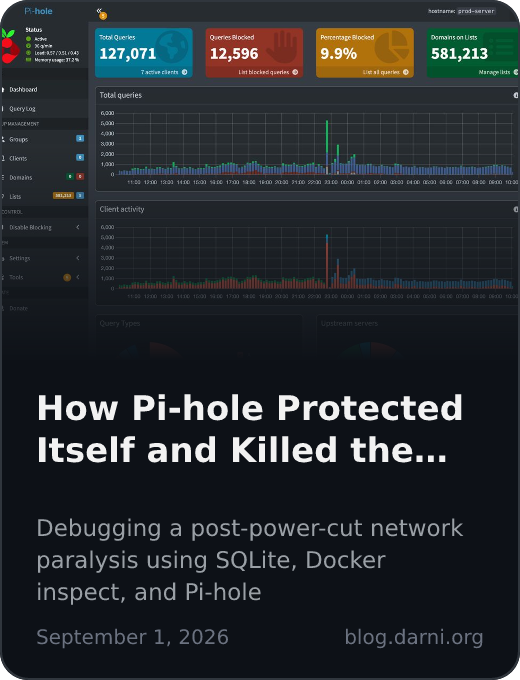
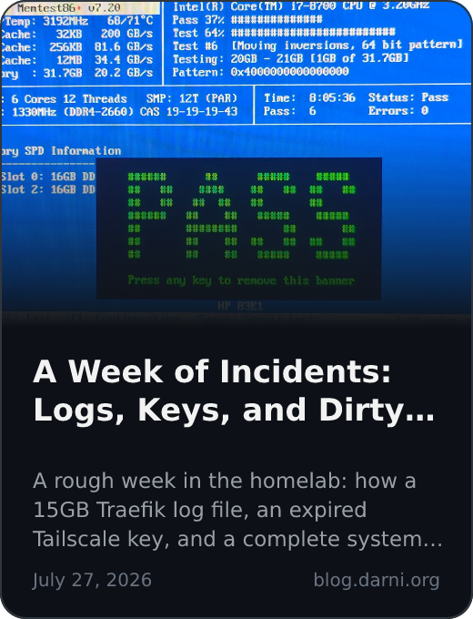

# Abdellah Darni

I build the layer that decides whether a server recovers on its own at 2 a.m. or someone has to drive in and fix it. Most of my work is backend services and the bare-metal Linux infrastructure they run on, with regular detours into the systems-level C underneath.

Final-year computer engineering student at FST Settat, **looking for a PFE internship starting early 2027** in infrastructure, DevOps or backend.

I write up the debugging rabbit holes I fall into, mostly so future-me remembers how I got out, at [darni.org/blog](https://darni.org/blog/).

📫 [LinkedIn](https://www.linkedin.com/in/darni-abdellah/) · [contact@darni.org](mailto:contact@darni.org) · CV: [English](https://darni.org/cv/abdellah-darni-cv-en.pdf) / [Français](https://darni.org/cv/abdellah-darni-cv-fr.pdf)

---

### Featured Engineering

* **[ROFEO Infrastructure Template](https://github.com/abdellah-darni/rofeo-ansible-template)**: The Ansible code from my PFA internship at ROFEO Academy, where I was the only engineer for two months. My build-vs-buy study replaced a from-scratch spec with a customized Moodle 5, which ROFEO piloted with teachers and students. Idempotent Ansible roles take a fresh Ubuntu 24.04 server to a running LMS (nginx, PHP-FPM, PostgreSQL 16, Redis), with backups on systemd timers, an offsite copy to Azure Blob via rclone, SHA-pinned rollback and tested restores. [Project page](https://darni.org/projects/rofeo-lms/).

* **[Homelab](https://github.com/abdellah-darni/home-lab)**: A Proxmox host serving my self-hosted stack as version-controlled Docker Compose behind a single Traefik v3 reverse proxy. Dual-provider routing pairs Docker label discovery with a watched file provider that brings non-Docker backends (Proxmox, a Jellyfin LXC) under the same TLS and middleware. Wildcard TLS via the Cloudflare DNS-01 challenge, a middleware chain enforcing LAN/Tailscale-only access with hardened security headers, and per-container capability drops and resource limits. Remote access over a Tailscale mesh, with a subnet-router LXC alongside per-VM clients. [Project page](https://darni.org/projects/homelab/) and [write-up](https://darni.org/blog/architecting-modular-home-lab/).

* **[DeepDame](https://github.com/sefault-dev/DeepDame)**: Real-time multiplayer checkers, built by a team of five. I owned the live game state (Redis with a rolling TTL, written once to MongoDB when a game ends, with self-healing reads that fixed stale-key lockouts) and built the STOMP/WebSocket layer: JWT auth on CONNECT, matchmaking, chat, and an LLM opponent that falls back to a legal move. Load-tested to saturation at 6,000 concurrent sessions on single-node k3s with a custom k6 STOMP harness. In the second semester I led the Flutter client (Riverpod, Freezed, GoRouter, STOMP over SockJS), and production ran on my homelab behind a Cloudflare Tunnel. [Project page](https://darni.org/projects/deepdame/).

* **[ToDoist](https://github.com/abdellah-darni/ToDoist)**: A terminal task manager written in C. Multi-panel ncurses interface using the menu, form, and panel libraries, with a non-blocking input loop, a live clock, and terminal-resize handling. SQLite storage through the C API: multi-statement writes wrapped in transactions with rollback on error, UUID primary keys (libuuid), a tasks/tags many-to-many schema with foreign keys, and soft deletes. Makefile with release, debug, AddressSanitizer, Valgrind, and gdb/lldb crash-report targets; builds on Linux and macOS, with a GitHub Actions build check.

### Latest posts

<!-- BLOG-CARDS:START -->

&nbsp;

&nbsp;

<!-- BLOG-CARDS:END -->

### Stack

&nbsp;
&nbsp;
&nbsp;
